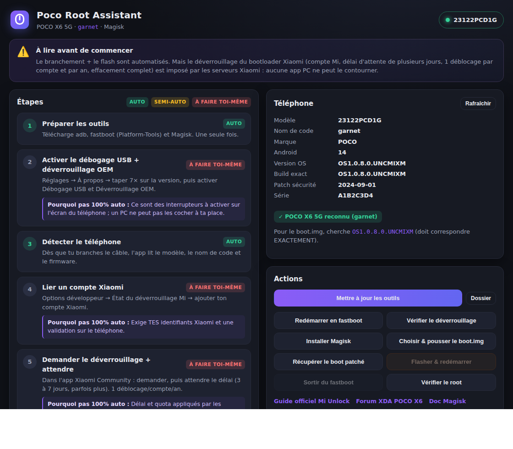

# Poco Root Assistant

Assistant Windows **guidé et semi-automatique** pour rooter un **POCO X6 5G**
(nom de code `garnet`) avec **Magisk**.

Tu branches ton téléphone en USB (débogage activé), l'app **détecte** l'appareil,
**télécharge et prépare tous les outils** (adb, fastboot, Magisk), **automatise**
tout ce qui peut l'être (détection, flash, récupération du boot patché…) et
**t'indique clairement, étape par étape, ce qui ne peut pas être fait en totale
autonomie** — et pourquoi.



---

## ⚠️ À lire d'abord : l'honnêteté sur le « root 100 % automatique »

Un vrai **« je branche et c'est rooté tout seul » n'existe pas** sur un POCO/Xiaomi
récent, et aucune application PC ne peut le faire. La raison :

> Le **déverrouillage du bootloader** est verrouillé **côté serveurs Xiaomi**.
> Il exige un **compte Xiaomi** lié à l'appareil, un **délai d'attente imposé**
> (souvent 3 à 7 jours, parfois plus), une **limite d'1 déblocage par compte et
> par an**, et il **efface toutes les données** du téléphone.

Personne ne peut contourner ça sans **exploiter** le téléphone (faille de
sécurité) — ce que cette application **ne fait pas**, par principe. C'est aussi
une bonne nouvelle : ça veut dire que l'outil est honnête et sûr.

Ce que l'app fait donc : **elle automatise tout le reste**, et pour chaque étape
verrouillée par Xiaomi, elle te dit exactement **quoi faire** et **pourquoi** elle
ne peut pas le faire à ta place.

### Qui fait quoi

| Étape | Qui | Pourquoi |
|---|---|---|
| Télécharger/préparer adb, fastboot, Magisk | 🟢 **L'app** | — |
| Détecter le téléphone + lire le firmware exact | 🟢 **L'app** | — |
| Activer Débogage USB + Déverrouillage OEM | 🔴 **Toi** | Interrupteurs sur l'écran du téléphone |
| Lier un compte Xiaomi | 🔴 **Toi** | Tes identifiants + validation sur le téléphone |
| Demander le déverrouillage + **attendre le délai** | 🔴 **Toi** | Délai & quota imposés par Xiaomi |
| Déverrouiller le bootloader (**efface tout**) | 🔴 **Toi** | Outil officiel Xiaomi + effacement = ta décision |
| Vérifier le déverrouillage (`fastboot`) | 🟢 **L'app** | — |
| Récupérer le bon `boot.img` d'origine | 🟡 **Semi** | L'app t'indique la version exacte ; tu fournis la ROM |
| Patcher `boot.img` dans Magisk | 🟡 **Semi** | Le patch tourne dans l'app Magisk (1 tap) |
| Récupérer le `boot` patché | 🟢 **L'app** | — |
| Flasher le `boot` patché + redémarrer | 🟢 **L'app** | — |
| Vérifier le root | 🟢 **L'app** | — |

---

## 🚨 Avertissements

- **Rooter efface tout le téléphone** (le déverrouillage du bootloader wipe les données). **Sauvegarde avant.**
- Tu **perds la garantie** et certaines fonctions (paiement sans contact, apps bancaires, Netflix HD, jeux anti-triche) peuvent **cesser de fonctionner** à cause de l'intégrité Play.
- **Un mauvais `boot.img` (qui ne correspond pas exactement au firmware) = bootloop.** L'app te donne la version exacte à utiliser, mais c'est à toi de fournir la bonne ROM.
- Tu fais ça **à tes propres risques**. Les auteurs ne sont pas responsables d'un téléphone endommagé.
- N'utilise cette app **que sur un téléphone qui t'appartient**.

---

## Installation

### Option A — Télécharger l'installeur (recommandé)

1. Va dans l'onglet **Actions** du dépôt → workflow **« Poco Root Assistant (Windows build) »**.
2. Ouvre le dernier run réussi → section **Artifacts** → télécharge **`PocoRootAssistant-Windows`**.
3. Dézippe et lance **`Poco Root Assistant_x.y.z_x64-setup.exe`**.

> L'installeur installe aussi automatiquement le runtime **WebView2** si besoin (inclus dans Windows 10/11 récents).

### Option B — Compiler soi-même

Prérequis : [Rust](https://rustup.rs) (stable, MSVC), Windows 10/11.

```powershell
cargo install tauri-cli --version "^2.0" --locked
cd poco-root-assistant/src-tauri
cargo tauri build
# Installeur généré dans : src-tauri/target/release/bundle/nsis/
```

---

## Utilisation

1. **Lance l'app** et clique **« Préparer les outils »** (télécharge adb, fastboot, Magisk — une seule fois).
2. Sur le téléphone : active **Options développeur**, **Débogage USB** et **Déverrouillage OEM**.
3. **Branche** le POCO X6 5G en USB et accepte l'autorisation de débogage. L'app affiche le modèle, le nom de code (`garnet`) et **la version exacte du firmware**.
4. Suis les étapes **rouges** (compte Xiaomi, demande de déverrouillage, attente, Mi Unlock Tool). L'app te donne les liens et explications.
5. Une fois le bootloader **déverrouillé** : clique **« Vérifier le déverrouillage »**.
6. **Récupère le `boot.img`** correspondant exactement à la version affichée, puis **« Choisir & pousser le boot.img »**.
7. **« Installer Magisk »**, ouvre Magisk sur le téléphone → *Installer → Sélectionner et patcher un fichier* → choisis le `boot.img`.
8. **« Récupérer le boot patché »**, puis **« Redémarrer en fastboot »** et **« Flasher & redémarrer »**.
9. **« Vérifier le root »** 🎉

---

## Comment ça marche (architecture)

- **`core/`** — logique pure en Rust (parsing `adb`/`fastboot`/Magisk, plan des étapes). **Couverte par des tests unitaires** : c'est le cœur critique, il est vérifié automatiquement.
- **`src-tauri/`** — application [Tauri 2](https://tauri.app) (Rust) : lance adb/fastboot, télécharge les outils, surveille le port USB et expose des commandes au frontend.
- **`src/`** — interface web statique (HTML/CSS/JS), légère et sans dépendance de build.

Les binaires officiels **ne sont pas** redistribués dans le dépôt : l'app
télécharge **adb/fastboot** depuis Google et **Magisk** depuis GitHub au premier
lancement, puis les met en cache localement. Avantages : installeur léger,
versions toujours à jour, aucune question de licence de redistribution.

---

## 🎁 Bonus — les meilleures apps & modules après le root

> La plupart s'installent **dans Magisk** (onglet *Modules*) ou en APK. À utiliser de façon responsable.

### Indispensables root

| Outil | À quoi ça sert |
|---|---|
| **Magisk** | Gestion du root (systemless), base de tout le reste |
| **Zygisk** (dans Magisk) | Active l'injection de modules dans les apps |
| **LSPosed** (Zygisk) | Framework de tweaks/modules Xposed (personnalisation profonde) |
| **Shamiko** | Cacher le root aux apps sensibles (banque, etc.) |
| **Play Integrity Fix** | Aider à passer l'intégrité Play (jeu du chat et de la souris, pas garanti) |

### Confidentialité / dé-bloat

| Outil | À quoi ça sert |
|---|---|
| **Universal Android Debloater (UAD)** | Supprimer les bloatwares (ce dépôt !) — pas besoin de root |
| **AdAway** | Bloqueur de pub système (hosts), nécessite root |
| **AFWall+** | Pare-feu par application (root) |
| **TrackerControl** | Bloquer les traqueurs |

### Sauvegarde / utilitaires

| Outil | À quoi ça sert |
|---|---|
| **Swift Backup** | Sauvegarde apps + données (root = complet) |
| **App Manager** | Inspecter/gérer les apps en profondeur |
| **Shizuku** | Donner des privilèges élevés à des apps sans root (complémentaire) |
| **Viper4Android / JamesDSP** | Égaliseur audio avancé |
| **Franco Kernel Manager** | Gérer le kernel, la batterie, les perfs |

---

## Crédits & licences

- **adb / fastboot** — [Android SDK Platform-Tools](https://developer.android.com/tools/releases/platform-tools) (Google).
- **Magisk** — [topjohnwu/Magisk](https://github.com/topjohnwu/Magisk) (GPL-3.0).
- **Tauri** — [tauri-apps/tauri](https://github.com/tauri-apps/tauri).
- Infos appareil : nom de code `garnet` confirmé via [LineageOS wiki](https://wiki.lineageos.org/devices/garnet/).

Cette application est distribuée sous licence **GPL-3.0**, comme le projet UAD qui l'héberge.

> ⚖️ Projet indépendant, non affilié à Xiaomi, POCO, Google ou les développeurs de Magisk.
